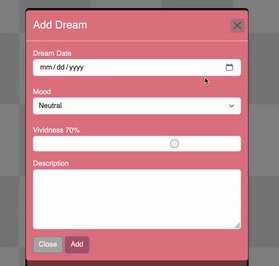

# Dream Diary 

Welcome to the Dream Diary website! This web application allows users to log their dreams, including details such as the dream date, mood, vividity, and description. Users can add, edit, and delete their dreams, providing a comprehensive record of their dream experiences.

Features

    Add Dream: Users can log a new dream by providing the dream date, mood, vividity level, and a description.
    Edit Dream: Users can edit existing dreams, modifying details such as the dream date, mood, vividity, and description.
    Delete Dream: Users can delete dreams they no longer wish to keep in their diary.
    Sorting: Dreams are displayed in either ascending or descending order based on their ID number.
    Interactive UI: The website features an intuitive user interface with modal dialogs for adding, editing, and deleting dreams.

Technologies Used

    Frontend: HTML, CSS, JavaScript
    Backend: FastAPI (Python)
    Libraries/Frameworks: Bootstrap, Font Awesome

How to Use

    Adding a Dream: Click on the "Log a dream!" button to add a new dream. Fill in the dream date, select the mood, adjust the vividity level, and provide a description. Click on the "Add" button to save the dream.

    Editing a Dream: To edit an existing dream, click on the edit icon next to the dream you want to modify. Update the dream details in the modal dialog and click on the "Update" button to save the changes.

    Deleting a Dream: To delete a dream, click on the trash icon next to the dream you want to remove. Confirm the deletion in the modal dialog.

    Sorting Dreams: Click on the sort icon to toggle between ascending and descending order based on dream dates.

Credits

    Kikiyama for the audio and favicon art

    nekocarpet for the mood art
